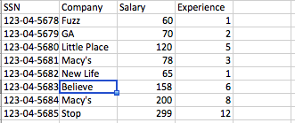

#  SQL Joins Lab

## Introduction

> ***Note:*** _This should be done independently._

In this lab, you will create SQL scripts for Postgres that will create and initialize a database with two tables - Employee and Job, and then query the data in those tables. You can build on the [starter code](../sql-joins-lesson/starter-code) that we worked on in the lesson.

Employee table has the following data:  

    

Job table looks like this:  

     

The main purpose of our scripts is to query information from both tables:  

1.  Show the full name of employees working at Macys
2.  Show the companies located in Boston  
3.  Show the full name of the employee with the highest salary  

## Exercise

### Requirements

The ``init_db.sql`` script should:  

- Create the database 

- Create the tables

- Populate the tables

The ``queries.sql`` script should:
  
- Run three queries, one for each of the following:

  -**Employees working at macys** - the button that will return the full names of employees working at Macys
  -**Companies in Boston** - the button that will return companies located in Boston
  -**Employee with the highest salary** - the button that will return the employee name with the highest salary

*Note: Those two files can call other files if you wish.*

### Starter Code

The [starter code](starter-code) TODO

### Deliverable

A pull request with all your code for a working app that meets the requirements above.

## ADDITIONAL RESOURCES

- 
