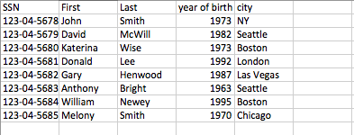

#  SQL Joins Lab

## Introduction

> ***Note:*** _This should be done independently._

In this lab, you will create an app with a database with two tables - Employee and Job.  

Employee table has the following data:  

    

Job table looks like this:  

     

The main purpose of the app is to provide information, which is pulled from both tables:  

1.  Show the full name of employees working at Macys
2.  Show the companies located in Boston  
3.  Show the full name of the employee with the highest salary  

Your app doesn't need to look like the screenshot, but it needs to have the same functionality.

## Exercise

#### Requirements

TODO: Turn this into a vanilla Java lab

The Main Activity should:  

- Populate the database when launched
  - Complete the `addEmployee()` and `addJob()` methods in the `Helper` class
  
- Contain 3 buttons that display their results in a `RecyclerView`:
  -**Employees working at macys** - the button that will return the full names of employees working at Macys
  -**Companies in Boston** - the button that will return companies located in Boston
  -**Employee with the highest salary** - the button that will return the employee name with the highest salary

#### Starter Code

The [starter code](starter-code) project contains code in `MainActivity` to add records to the database, so you don't have to type them all out.
However, the `addEmployee()` and `addJob()` methods in the `Helper` must still be completed.

The project also contains several `TODO` comments guiding you on where to add code to complete the requirements listed above.

#### Deliverable

A pull request with all your code for a working app that meets the requirements above.

You can get creative with the formatting if you like, but the basic functionality should be this:

## ADDITIONAL RESOURCES

- [SQLiteQueryBuilder documentation](https://developer.android.com/reference/android/database/sqlite/SQLiteQueryBuilder.html)
