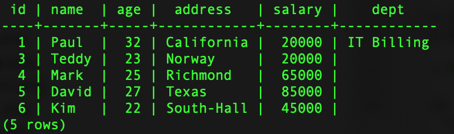

#  SQL JOINs

### Learning Objectives

*After this lesson, students will be able to:*
* Identify reasons to use multiple tables.
* Determine which columns should be primary and foreign keys.
* Implement JOIN statements to retrieve data from multiple tables.

### Lesson Guide

| TIMING  | TYPE  | TOPIC  |
|:-:|---|---|
| 5 min  | Opening | Lesson Objectives |
| 20 min | Introduction | Review Primary/Foreign Key and PostgreSQL JOINs |
| 20 min | Demo | Inner JOINs |
| 30 min | Guided Practice | Inner JOINs in Java |
| 30 min | Independent Practice  | Inner JOINs in Java |
| 5 min  | Conclusion  | Review/Recap |

## Opening (5 min)

Relationships in databases specify the connection between tables and enable you to pull data together in meaningful ways. A hefty part of designing a relational database is dividing the data elements into related tables.

Once you're ready to start working with the data, you rely on relationships between the tables; in practice, this is done with JOINs.

-------

## Introduction: Review Primary/Foreign Key and PostgreSQL JOINs (20 min)

SQL JOINs are a way of combining records from two or more tables in a database.

A JOIN is a means of combining fields from two tables using values that are common to both.

When we talk about relationships between tables, we use two important terms:

- **Primary key**: A column or group of columns that uniquely identifies a row. Every table should have a primary key; a table cannot have more than one primary key.
- **Foreign key**: A column or group of columns in one table whose values must have matching values in the primary key of another (or the same) table. A foreign key is said to reference its primary key. Foreign keys are a mechanism for maintaining data integrity.

For example, we have two tables:  

Supplier ( **SupplierNumber**, Name, Address, Type )  
Invoices ( **InvoiceNumber**, *SupplierNumber*, Info )

The `SupplierNumber` is the primary key in the `Supplier` table. The foreign key in the `Invoices` table points to that primary key. The relational schema is the following: Primary keys are marked in bold, and foreign keys are marked in italics.

### One More Example

Let's look at the table below. It's a relatively big table with a lot of columns and rows that make reading and analyzing data difficult. As you might have already noticed, the columns `Fruit`, `Fruit ID`, and `Inventory` have a lot of duplicate data:

<p align="text">
  
</p>

In order to make the data more readable and better organized, we should exclude duplicates and create two tables:  

<p align="text">
    
</p>

Thus, the table with fewer records, `Available Fruits`, has one record for each `A`, `B`, `C`, `D`, and `E`. The table with more records, `Sales Today`, has multiple records each for `A`, `B`, `C`, `D`, and `E`.

> **Knowledge Check**: In this example, what are the tables' primary and foreign keys?

### Types of JOINs

SQL defines three major types of JOINs:  

* **INNER JOIN**: Selects all rows from both participating tables as long as there is a match between the columns.
* **OUTER JOIN**: Returns all rows from both the participating tables that satisfy the JOIN condition, along with rows that do not satisfy the JOIN condition.  
* **CROSS JOIN**: Produces a result set that is the number of rows in the first table multiplied by the number of rows in the second table, if no WHERE clause is used along with CROSS JOIN. This kind of result is called a "Cartesian product." If the WHERE clause is used with CROSS JOIN, it functions like an INNER JOIN:

<p align="center">
  
</p>

_Image source: [https://www.codeproject.com/Articles/33052/Visual-Representation-of-SQL-Joins](https://www.codeproject.com/Articles/33052/Visual-Representation-of-SQL-Joins)_
        
An INNER JOIN is the most common type of JOIN and is the default type of JOIN. Using the INNER keyword is optional.

An INNER JOIN creates a new result table by combining column values of two tables (`table1` and `table2`) based upon the JOIN predicate.

The query compares each row of `table1` with each row of `table2` to find all pairs of rows that satisfy the JOIN predicate. When the JOIN predicate is satisfied, column values for each matched pair of rows from `table1` and `table2` are combined into a result row.

The following is the syntax of an INNER JOIN:  

```SQL
SELECT col1, col2, colN FROM table1 [INNER] JOIN table2 ON conditional_expression ...
```

> **Knowledge Check**: What do you think would be common columns to compare between two tables?

-----

## Demo: Inner JOINs (20 min)

We will use the `generalassembly` database that we worked on yesterday. 

Take the two tables we created yesterday.

`STUDENTS`

```
generalassembly=# SELECT * FROM students;
 student_id |      name      | age |    mobile    | students_address_id
------------+----------------+-----+--------------+---------------------
          6 | Slaggy McRaggy |  28 |              |
          1 | Jack Sparrow   |  43 | 999-999-9999 |                   1
          2 | Jilly Cakes    |  30 | 910-111-1111 |                   2
          3 | Johnny Bananas |  25 | 678-111-1234 |                   3
          5 | Jackie Lackie  | 101 | 910-456-7890 |                   4
(5 rows)
```

`ADDRESS`

```
generalassembly=# SELECT * FROM address;
 address_id |     street      |    city     | state
------------+-----------------+-------------+--------
          1 | sesame street   | Sesame City | Sesame
          2 | 123 Webdev Dr.  | Boston      | MA
          3 | 555 Five St     | Fivetowns   | NY
          4 | 2 OldForThis Ct | Fivetowns   | NY
(4 rows)
```

Let's say we want to find out the name of the students and which city and state each student lives in.

```
SELECT name, city, state 
FROM students 
INNER JOIN address 
ON student_address_id = address_id;
```

> **Knowledge Check**: Take a minute and predict the results of the query with the person next to you.

The query will produce the following result:

```
generalassembly=# SELECT name, city, state FROM students INNER JOIN address ON student_address_id = address_id;
      name      |    city     | state
----------------+-------------+--------
 Jack Sparrow   | Sesame City | Sesame
 Jilly Cakes    | Boston      | MA
 Johnny Bananas | Fivetowns   | NY
 Jackie Lackie  | Fivetowns   | NY
(4 rows)
```

As we can see from the query, we compare the tables based on one column in each:

* `student_address_id` in the `students` table.  
* `address_id` in the `address` table.  

The returned data includes information about `name`, `city`, and `state`.

### Using `WHERE` clause with INNER joins.

Find all the students that live in 'NY' state.
	
```
SELECT name, city, state 
FROM students 
INNER JOIN address 
ON student_address_id = address_id 
WHERE state = 'NY';
```
	
The result will be,
	
```
   		name      |   city    | state
----------------+-----------+-------
 Johnny Bananas | Fivetowns | NY
 Jackie Lackie  | Fivetowns | NY
(2 rows)
```


<!--Let's consider two tables, `EMPLOYEES` and `DEPARTMENTS`:   

`EMPLOYEES`:

<p align="center">
     
</p>

The table has five columns: `ID`, `NAME`, `AGE`, `ADDRESS`, and `SALARY`.  

`DEPARTMENTS`:    

<p align="center">
     
</p>

The table has three columns: `ID`, `DEPT`, and `EMP_ID`.

Based on the tables above, we can write an INNER JOIN as follows:  

```SQL
SELECT EMP_ID, NAME, DEPT FROM EMPLOYEES INNER JOIN DEPARTMENTS ON EMPLOYEES.ID = DEPARTMENTS.EMP_ID
```
> **Knowledge Check**: Take a minute and predict the results of the query with the person next to you.

The query will produce the following result:  

<p align="center">
    
</p>

As we can see from the query, we compare the tables based on one column in each:

* `ID` in the `EMPLOYEES` table.  
* `EMP_ID` in the `DEPARTMENTS` table.  

The returned data includes information about `EMP_ID`, `NAME`, and `DEPT`.-->

------

## Independent Practice: Inner JOINs

Now you ll use inner joins to query `courses` and `instructors` tables. The data in both the tables is:

`COURSES`

```
generalassembly=# SELECT * FROM courses;
 course_id | course_code |      course_name
-----------+-------------+-----------------------
         1 | CNT         | Counting
         2 | HTS         | How To Be a Superhero
         3 | HTP         | How To Be a Pirate
(3 rows)
```

`INSTRUCTORS`

```
generalassembly=# SELECT * FROM instructors;
 instructor_id |      name       |       email        | instructor_course_id
---------------+-----------------+--------------------+----------------------
             1 | Asheley         | email              |                    2
             2 | Captain Barbosa | barbosa@pirate.com |                    3
             3 | Davy Jones      | jones@pirate.com   |                    3
(3 rows)
```

1. Let's write a query that returns the `name` and `email` of all the instructors that are teaching `How To Be a Pirate` course.
2. Conversely, we also want to find out the name of the course that `Asheley` is teaching.

<details><summary>Query 1</summary>

```
SELECT name 
FROM instructors 
INNER JOIN courses 
ON course_id = instructor_course_id 
WHERE course_name = 'How To Be a Pirate';
```

The output will be,

```
      name
-----------------
 Captain Barbosa
 Davy Jones
(2 rows)
```

</details>


<details><summary>Query 2</summary>

```
SELECT course_name 
FROM instructors 
INNER JOIN courses 
ON course_id = instructor_course_id 
WHERE name = 'Asheley';
```

Output, 

```
      course_name
-----------------------
 How To Be a Superhero
(1 row)
```

</details>

<!--Import the project [starter code](starter-code). Use commands in [`commands.md`](commands.md) to create a database called `COMPANY`, along with the database tables, and then insert data. 

If we were writing plain SQL, our query asking for the name of the person would look like this:

```sql
SELECT NAME FROM EMPLOYEES INNER JOIN DEPARTMENTS ON EMPLOYEES.ID = DEPARTMENTS.EMP_ID;
```

As mentioned above, we compare two tables on the following columns:

* `ID` in the `COMPANY` table.
* `EMP_ID` in the `DEPARTMENTS` table.    

> Take two minutes to figure out what the query should return.

In our examples, we can see that the second entry in the `EMPLOYEES` table is associated with the name `Allen`, and the table has an `ID` column that gets auto-incremented every time we add a new entry. In the `DEPARTMENTS` table, the second row has `EMP_ID` equal `2`. The same happens with the `EMP_ID` of `7`. Thus, the names `Paul`, `Allen`, and `James` are returned.-->

-------

## Bonus: Inner JOIN with 3 Tables (30 min)

We will now focus on using joins with the JOIN table `student_course_enrollment`. Let's look at the data in the tables.

`STUDENTS`

```
generalassembly=# SELECT * FROM students;
 student_id |      name      | age |    mobile    | students_address_id
------------+----------------+-----+--------------+---------------------
          6 | Slaggy McRaggy |  28 |              |
          1 | Jack Sparrow   |  43 | 999-999-9999 |                   1
          2 | Jilly Cakes    |  30 | 910-111-1111 |                   2
          3 | Johnny Bananas |  25 | 678-111-1234 |                   3
          5 | Jackie Lackie  | 101 | 910-456-7890 |                   4
(5 rows)
```

`COURSES`

```
generalassembly=# SELECT * FROM courses;
 course_id | course_code |      course_name
-----------+-------------+-----------------------
         1 | CNT         | Counting
         2 | HTS         | How To Be a Superhero
         3 | HTP         | How To Be a Pirate
(3 rows)
```

`STUDENT_COURSE_ENROLLMENT`

```
generalassembly=# SELECT * FROM student_course_enrollment;
 enrollment_id | student_id | course_id
---------------+------------+-----------
             1 |          5 |         2
             2 |          6 |         2
(2 rows)
```


Find out which course `Jackie Lackie` is taking.

```
SELECT c.course_name
FROM student_course_enrollment sce
INNER JOIN courses c ON sce.course_id = c.course_id
INNER JOIN students s ON s.student_id = sce.student_id
WHERE s.name = 'Jackie Lackie';
```

Output,

```
      course_name
-----------------------
 How To Be a Superhero
(1 row)
```

<!--Using the app above, create a query that will not only return the name of the person but will also provide the information about the employee's age, address, salary, and department (whether or not they have been assigned a department) for employees making more than $15,000.

```sql
SELECT col1, col2, colN FROM table1 [INNER] JOIN table2 ON conditional_expression ...
```

The query result should look like this:



-->
-------

## Conclusion (5 min)

- Why is it important to create different tables? Why shouldn't we have one big table?
- What types of relationships have you learned about today?
- What is the most popular type of JOIN?

