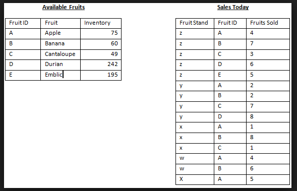
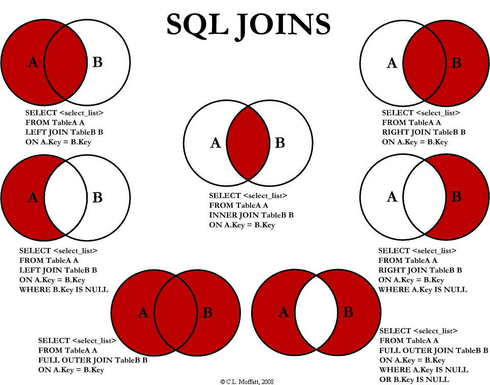

#  JOINS


### LEARNING OBJECTIVES
*After this lesson, you will be able to:*
- Identify the reasons to use multiple tables
* Determine which columns should be primary and foreign keys
* Implement Join statements to retrieve data from multiple tables

### STUDENT PRE-WORK
*Before this lesson, you should already be able to:*
- Create tables in PostgreSQL
- Use databases in back-end Java apps
- Identify the reasons to use multiple tables

### LESSON GUIDE

| TIMING  | TYPE  | TOPIC  |
|:-:|---|---|
| 5 min  | [Opening](#opening-5-mins)  | Discuss lesson objectives |
| 20 min  | [Introduction](#introduction-review-primaryforeign-key-and-sqlite-joins-20-mins)  | Review Primary/Foreign Key and PostgreSQL Joins |
| 15 min  | [Demo](#demo-inner-joins-15-mins)  | Inner Joins |
| 20 min  | [Guided Practice](#guided-practice-inner-joins-in-android-20-mins)  | Inner Joins in Java |
| 25 min  | [Independent Practice](#independent-practice-inner-joins-in-android-25-mins)  | Inner Joins in Java |
| 5 min  | [Conclusion](#conclusion-5-mins)  | Review / Recap |

## Opening (5 mins)

Relationships in databases specify the connection between tables and enable you to pull data together in meaningful ways.
A hefty part of designing a relational database is dividing the data elements into related tables.
Once you're ready to start working with the data, you rely on relationships between the tables - in practice, this is done with JOINS.


## Introduction: Review Primary/Foreign Key and PostgreSQL Joins (20 mins)

SQL joins are a way to combine records from two or more tables in a database.
A JOIN is a means for combining fields from two tables by using values common to each.
When we talk about relationships between tables we use two important terms:

- **Primary Key**: column or group of columns that uniquely identify a row. Every table should have a primary key. And a table cannot have more than one primary key.
- **Foreign Key**: column or group of columns in one table whose values must have matching values in the primary key of another (or the same) table. A foreign key is said to reference its primary key. Foreign keys are a mechanism for maintaining data integrity.

For example, we have two tables:  

Supplier ( **SupplierNumber**, Name, Address, Type )  
Invoices ( **InvoiceNumber**, *SupplierNumber*, Info )

The 'supplier number' is the primary key in the Supplier table. The foreign key in the Invoices table points to that primary key. The relational schema is the following. Primary keys are marked in bold, and foreign keys are marked in italics.

#### One More Example

Let's look at the table below. It is a relatively big table with a lot of columns and rows, which makes data reading and analyzing difficult. As you might have already noticed the columns Fruit, Fruit ID and Inventory has a lot of duplicate data.

<p align="text">
  
</p>

In order to make data more readable and well-organized we should exclude duplication and create two tables:  

<p align="text">
    
</p>

Thus, the table with fewer records, Available Fruits, has one record for each A, B, C, D, and E. The table with more records, Sales Today, has multiple records each for A, B, C, D, and E.

> Check: What are the primary and foreign keys in the tables from this example?

#### Types of JOINS

SQL defines three major types of joins:  

* INNER JOIN - selects all rows from both participating tables as long as there is a match between the columns.
* OUTER JOIN - returns all rows from both the participating tables which satisfy the join condition along with rows which do not satisfy the join condition.  
* CROSS JOIN - produces a result set which is the number of rows in the first table multiplied by the number of rows in the second table, if no WHERE clause is used along with CROSS JOIN. This kind of result is called as Cartesian Product. If, WHERE clause is used with CROSS JOIN, it functions like an INNER JOIN.  

<p align="center">
  
</p>
_Image source: [https://www.codeproject.com/Articles/33052/Visual-Representation-of-SQL-Joins](https://www.codeproject.com/Articles/33052/Visual-Representation-of-SQL-Joins)_
        
An INNER JOIN is the most common type of join and is the default type of join.
You can use INNER keyword optionally.
An INNER JOIN creates a new result table by combining column values of two tables (table1 and table2) based upon the join-predicate.

The query compares each row of table1 with each row of table2 to find all pairs of rows which satisfy the join-predicate. When the join-predicate is satisfied, column values for each matched pair of rows of A and B are combined into a result row.

Following is the syntax of INNER JOIN:  

```SQL
SELECT col1, col2, colN FROM table1 [INNER] JOIN table2 ON conditional_expression ...
```

> Check: What do you think common columns to compare between two tables would be?

## Demo: Inner Joins (15 mins)
Let's consider two tables EMPLOYEES and DEPARTMENTS:   

EMPLOYEES:

<p align="center">
     
</p>

The table has 5 columns: ID, NAME, AGE, ADDRESS, SALARY.  

DEPARTMENTS:    

<p align="center">
     
</p>

The table has 3 columns: ID, DEPT, EMP_ID.

Based on the above tables, we can write an INNER JOIN as follows:  

```SQL
SELECT EMP_ID, NAME, DEPT FROM EMPLOYEES INNER JOIN DEPARTMENTS ON EMPLOYEES.ID = DEPARTMENTS.EMP_ID
```
> Check: Take a minute and predict the results of the query with the person next to you.

The query will produce the following result:  

<p align="center">
    
</p>

As we can see from the query, we compare the tables based on one column in each table:
* ID in the table EMPLOYEE  
* EMP_ID in the table DEPARTMENT  

The returned data includes information about EMP_ID, NAME and DEPT.

## Guided Practice: Inner Joins in Java (20 mins)

Import the project [starter-code](starter-code). Use commands in [commands.md](commands.md) to create a database called company, create the database tables, and then insert data. 

If we were writing plain SQL, our query asks for the name of the person would look like this:

```sql
SELECT NAME FROM EMPLOYEES INNER JOIN DEPARTMENTS ON EMPLOYEES.ID = DEPARTMENTS.EMP_ID;
```

As mentioned above we compare two tables on the following columns:

* ID in the COMPANY table
* EMP_ID in the DEPARTMENT table    

> Take 2 minutes to figure out what should the query return.

In our examples we can see that the second entry in the table EMPLOYEES is associated with the name "Allen", the table has an "ID" column that gets autoincremented every time we add a new entry. In the DEPARTMENT table the second row has EMP_ID equal 2. The same happens with the employee id of 7. Thus, we get the names "Paul", "Allen", and "James" returned.

## Independent Practice: Inner Joins in Java (25 mins)

Using the app above, create a query that will return not only the name of the person but will provide the information about the employee's age, address, salary and department for employees making more than $30,000.

```sql
SELECT col1, col2, colN FROM table1 [INNER] JOIN table2 ON conditional_expression ...
```

> Check: With 4 minutes left, review the solution with students.

## Conclusion (5 mins)

- Why is it important to create different tables? Why should we not have one big table?
- What types of relationships have you learned about today?
- What is the most popular type of joins?
